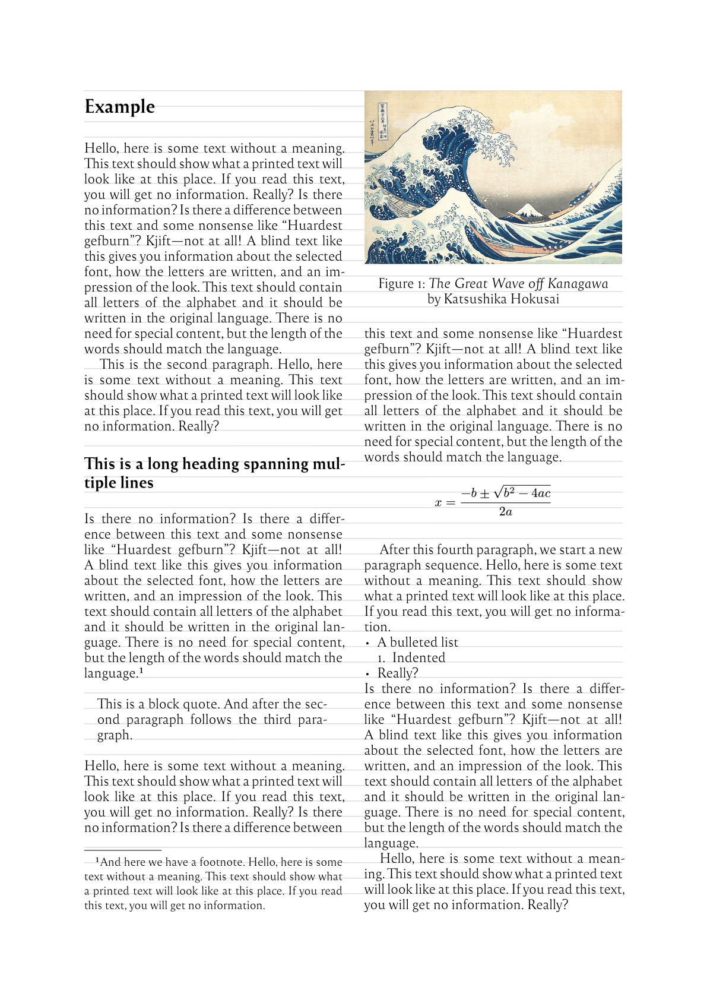

# The `gridlock` Package
<div align="center">Version 0.1.0</div>

Grid typesetting in Typst.
Use this package if you want to line up your body text across columns and pages.

## Example



## Template adaptation checklist

- [x] Fill out `README.md`
  - [x] Change the `my-package` package name, including code snippets
  - [ ] Check section contents and/or delete sections that don't apply
- [x] Check and/or replace `LICENSE` by something that suits your needs
- [x] Fill out `typst.toml`
  - See also the [typst/packages README](https://github.com/typst/packages/?tab=readme-ov-file#package-format)
- [ ] Adapt Repository URLs in `CHANGELOG.md`
  - Consider only committing that file with your first release, or removing the "Initial Release" part in the beginning
- [x] Adapt or deactivate the release workflow in `.github/workflows/release.yml`
  - to deactivate it, delete that file or remove/comment out lines 2-4 (`on:` and following)
  - to use the workflow
    - [x] check the values under `env:`, particularly `REGISTRY_REPO`
    - [x] if you don't have one, [create a fine-grained personal access token](https://github.com/settings/tokens?type=beta) with [only Contents permission](https://stackoverflow.com/a/75116350/371191) for the `REGISTRY_REPO`
    - [x] on this repo, create a secret `REGISTRY_TOKEN` (at `https://github.com/[user]/[repo]/settings/secrets/actions`) that contains the so created token

    if configured correctly, whenever you create a tag `v...`, your package will be pushed onto a branch on the `REGISTRY_REPO`, from which you can then create a pull request against [typst/packages](https://github.com/typst/packages/)
- [ ] remove/replace the example test case
- [x] (add your actual code, docs and tests)
- [ ] remove this section from the README

## Getting Started

These instructions will get you a copy of the project up and running on the typst web app. Perhaps a short code example on importing the package and a very simple teaser usage.

```typ
#import "@preview/gridlock:0.1.0": *

#show: gridlock.with()

#lock[= This is a heading]

#lorem(30)

#figure(
  placement: auto,
  caption: [a caption],
  rect()
)

#lorem(30)
```

## Usage

Check out [the manual](docs/manual.pdf) for a detailed description.

To get started, import the package into your document:

```typ
#import "@preview/gridlock:0.1.0": *
```

Set up the basic parameters:

```typ
#show: gridlock.with(
  paper: "a4",
  margin: (y: 76.445pt),
  font-size: 11pt,
  line-height: 13pt
)
```

You can now use the `lock()` function to align any block to the text grid.
Block quotes bulleted/numbered lists, and floating figures do _not_ need to be wrapped in `lock()`.
Their spacing is handled fully automatically.

```typ
#lock[= Heading]

#lorem(50)

#lock(figure(
  rect(),
  caption: [An example figure aligned to the grid.]
))

#lorem(50)

#lock[$ a^2 = b^2 + c^2 $]

#lorem(50)
```
